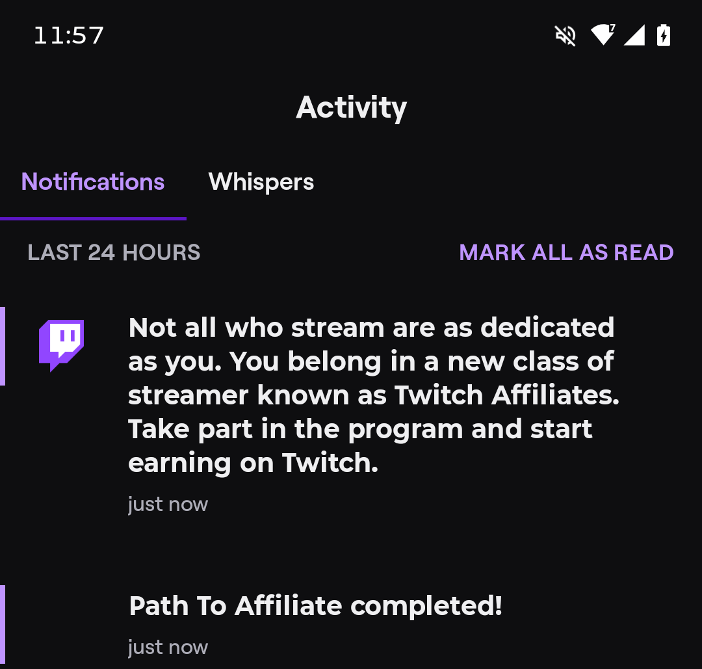

I just got Twitch Affiliate, so I want to go over some of the things that will be changing when it comes to my streams!

First of all, I want to thank everyone for helping me reach this milestone, it means the world and I hope to continue seeing y'all in stream as I work towards future goals!

# What changes?

A surprising amount about my streams will ***NOT*** be changing, however there are some changes.

## ads

Starting with today's celebration stream I will be running ads. Currently, I have it setup to run a 1.5-minute ad break every 18 minutes. I will adjust the amount of ads and the timing of ads based on viewer feedback and Twitch analytics.

My priority will always be to provide entertainment, my income should be based on that entertainment value, not slop made to make money off kids who get hooked into the content *cough cough* mr beast *cough cough* 5-minute crafts *cough cough*.

## Donations

Although they have been available for a while, donations such as subs and bits are available.

There is also a system called HudFX in my stream to add more, fun, ways to donate, feel free to check them out, or don't, I'm happy you are here, whether you donate or not!

Subs are a great way to support me while getting rid of ads! (and if you have amazon prime, you get one free sub each month!)

I'm sure there are a lot of other changes I don't yet know about, and I will be sure to update this blogpost, and the [community Discord server](https://altie.link/discord) about the changes! You can see any additions to this blogpost after the ending message!

# What stays the same?

I will still continue to provide, and improve upon, my content to make it as entertaining as possible, that will never change. I also still want feedback from the community, if not more than ever as I get into this new realm of content creation!

I will also maintain my normal 5 day a week schedule, which is as follows:
- Monday, Friday, Saturday & Sunday @ 5PM ET - variety stream (true variety or set topics depending on the stream)
- Wednesday @ 5PM ET - Timberborn
- Tuesday and Thursday - Off Days

The only exception will be today, August 6th, 2026 as I will be going live @ 5PM ET even though it is an Off Day to celebrate the achievement!

---

That is all I have for now, again I would like to thank all of you for making this possible.

Thank you for your time,

Alton "altie" Rose